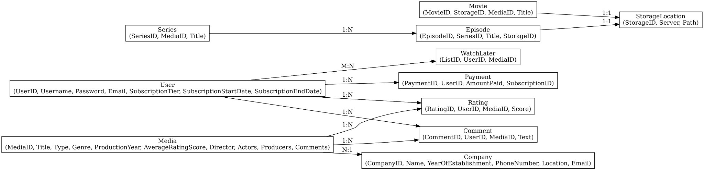
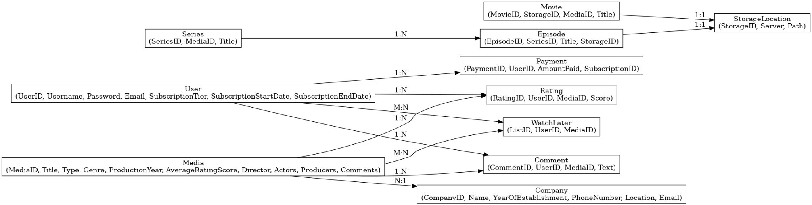

# Normalized Database Design for a Media Streaming Platform

## Project Overview

This project involves the design, normalization, and implementation of a relational database system for a media streaming service. The goal is to create a robust and efficient schema using the Entity-Relationship (ER) model, ensure normalization up to 2NF, and implement the system in PostgreSQL using SQL commands.

## Entity-Relationship Diagrams (EER)

The conceptual model for the database was designed using Enhanced Entity-Relationship (EER) diagrams. These diagrams represent various entities, such as Users, Media, Subscription, Ratings, and Comments, along with their relationships.

### EER Diagram Part 1

*The first part of the EER diagram includes entities like Users, Subscription, Media, and Comments.*

### EER Diagram Part 2

*The second part of the EER diagram includes entities like Episodes, Movies, Series, and Storage.*

## First Normal Form (1NF)

To satisfy 1NF:
- All attributes must be atomic.
- No multivalued or composite attributes are allowed.

### Changes Made:
- Fields like `Actors`, `Producers`, and `Comments` were initially stored as text arrays.
- We normalized these fields by creating separate tables:
  - `MediaActor(MediaID, Actor)`
  - `MediaProducer(MediaID, Producer)`
  - `Comment(CommentID, UserID, MediaID, Text)`

This ensured atomicity and removed repeating groups, thus achieving 1NF.

## Second Normal Form (2NF)

2NF requires:
- The schema must already be in 1NF.
- No partial dependency of non-key attributes on part of a composite primary key.

### Changes Made:
In the 1NF schema, `SubscriptionTier`, `StartDate`, and `EndDate` depended only on `UserID` in a table where the composite key could include other fields like `PaymentID`.

To fix this:
- Created a new table `Subscription(SubscriptionID, UserID, Tier, StartDate, EndDate)`.
- Updated related tables to remove redundant fields.

## SQL Schema Overview

The normalized schema is implemented in PostgreSQL using SQL. Below is a sample of the SQL code used for the schema:

```sql
CREATE TABLE Users (
    UserID SERIAL PRIMARY KEY,
    Username VARCHAR(255),
    Email VARCHAR(255),
    Password VARCHAR(255)
);

CREATE TABLE Subscription (
    SubscriptionID SERIAL PRIMARY KEY,
    UserID INT REFERENCES Users(UserID),
    Tier VARCHAR(50),
    StartDate DATE,
    EndDate DATE
);

CREATE TABLE Media (
    MediaID SERIAL PRIMARY KEY,
    Title VARCHAR(255),
    Genre VARCHAR(100),
    Type VARCHAR(50),
    ProductionYear INT,
    Director VARCHAR(255)
);
```

## Sample Advanced SQL Queries

### 1. Top 5 Most Watched Media
```sql
SELECT m.Title, COUNT(*) AS Views
FROM WatchHistory w
JOIN Media m ON w.MediaID = m.MediaID
GROUP BY m.Title
ORDER BY Views DESC
LIMIT 5;
```

### 2. User Activity in the Last 30 Days
```sql
SELECT u.Username, m.Title, w.Timestamp
FROM WatchHistory w
JOIN Users u ON w.UserID = u.UserID
JOIN Media m ON w.MediaID = m.MediaID
WHERE w.Timestamp >= NOW() - INTERVAL '30 days';
```

### 3. Average Rating per Genre
```sql
SELECT Genre, AVG(Score) AS AvgRating
FROM Media m
JOIN Rating r ON m.MediaID = r.MediaID
GROUP BY Genre;
```

## Conclusion

This project demonstrates the transformation of a conceptual EER model into a relational schema, normalized to 2NF, and implemented in PostgreSQL. The structured design ensures data consistency, removes redundancy, and supports powerful SQL queries for media streaming insights.

---
### Files Included
- **EER Diagrams**: `eer1_converted.jpg`, `eer2_converted.jpg`
- **SQL Schema**: Complete SQL code used for database creation.

### License
This project is licensed under the MIT License.
